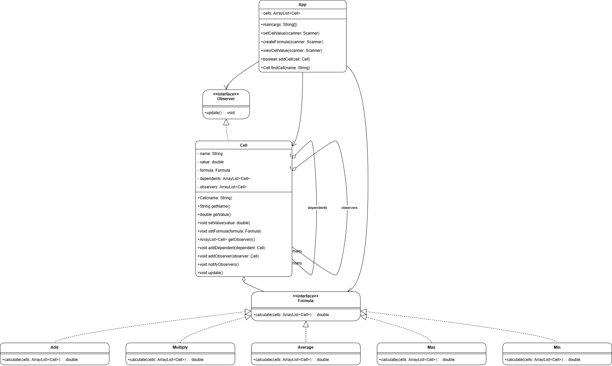

# Assignment 1

In this assignment, we explored key concepts from the Design Patterns course to implement foundational patterns in software design, focusing on creating flexible, modular, and maintainable code structures.

## Explanation

1. **Encapsulate What Varies**  
The program encapsulates varying calculation behaviors by using a `Formula` interface, allowing different strategies (e.g., `Add`, `Multiply`) to be implemented independently. This design enables easy addition of new formulas without modifying existing code.

2. **Favor Composition Over Inheritance**  
The `Cell` class employs composition by holding a reference to a `Formula` object rather than inheriting from it. This approach promotes modularity, allowing dynamic assignment of calculation behaviors at runtime.

3. **Program to Interfaces, Not Implementations**  
The program uses the `Formula` interface for setting formulas in cells, enabling flexibility in handling any calculation strategy that implements this interface. This abstraction facilitates easy extension with new formulas.

4. **Strive for Loosely Coupled Designs**  
By implementing the **Observer** pattern, the program achieves loose coupling between cells. Cells notify their observers of changes, allowing for independent updates without direct dependencies, thereby enhancing maintainability and extensibility.

## Class Diagram

