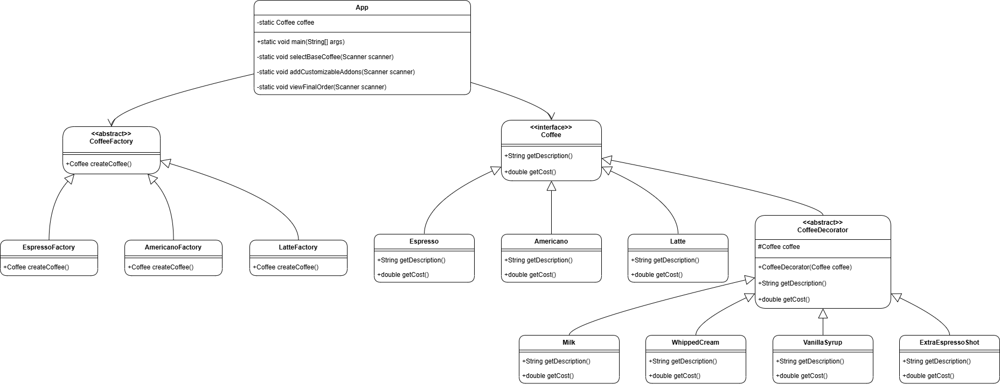

# Assignment 2

In this assignment, we explored key concepts from the Design Patterns course to implement foundational patterns in software design, focusing on creating flexible, modular, and maintainable code structures.

## Explanation

1. **Encapsulate What Varies**  
The program encapsulates the variability in coffee types and add-ons using the **Factory Method** and **Decorator Pattern**, respectively. The creation of base coffee types (`Espresso`, `Americano`, `Latte`) is encapsulated in their respective factories, while customization options such as `Milk`, `Vanilla Syrup`, and `Extra Espresso Shot` are dynamically applied using decorators. This design makes it easy to introduce new coffee types or add-ons without altering existing code.

2. **Favor Composition Over Inheritance**  
The program uses composition by wrapping coffee objects with decorator classes (`Milk`, `WhippedCream`, etc.) instead of relying solely on inheritance. This allows each add-on to be dynamically combined with any base coffee at runtime, avoiding a rigid class hierarchy and ensuring modularity.

3. **Program to Interfaces, Not Implementations**  
Both base coffee types and decorators implement the `Coffee` interface, ensuring that the program operates on the abstraction rather than specific implementations. This approach provides flexibility, as any class conforming to the `Coffee` interface can seamlessly integrate into the system, whether it's a new type of coffee or a new add-on.

4. **Strive for Loosely Coupled Designs**  
The separation of concerns between the coffee creation process (handled by the **Factory Method**) and the customization process (handled by the **Decorator Pattern**) ensures loose coupling. For example, the `App` class does not need to know about specific implementations of coffee types or add-ons—it interacts with them through the `Coffee` interface. This loose coupling enhances the system's maintainability and extensibility.

5. **Classes Should Be Open for Extension but Closed for Modification**  
The program adheres to this principle by making it easy to extend functionality without modifying existing classes. Adding a new base coffee type requires creating a new factory and coffee class, while introducing a new add-on involves creating a new decorator. Neither requires changes to the existing structure, thus adhering to the Open/Closed Principle.

6. **Depend on Abstractions, Not on Concrete Classes**  
The program depends on the `Coffee` interface rather than concrete coffee or decorator classes. For instance, the decorators work with any `Coffee` implementation, making the system flexible and adaptable to future changes. Similarly, the `App` class interacts with the `Coffee` and `CoffeeFactory` abstractions, decoupling it from specific implementations.

## Class Diagram

