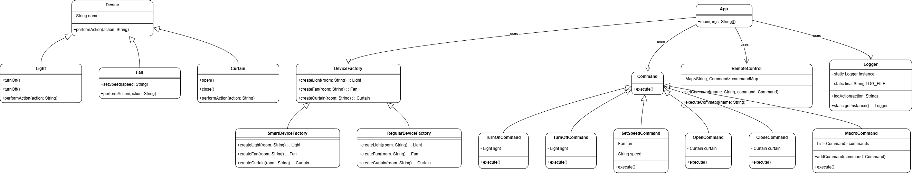

# Assignment 3

In this assignment, we explored key concepts from the Design Patterns course to implement foundational patterns in software design, focusing on creating flexible, modular, and maintainable code structures.

# Explanation

1. **Abstract Factory Pattern**
The **Abstract Factory** pattern is used to encapsulate the creation of related device families (e.g., Light, Fan, Curtain) for different types of homes. The `DeviceFactory` interface provides a blueprint for creating devices, with concrete implementations including `SmartDeviceFactory` for creating smart devices and `RegularDeviceFactory` for creating regular devices. Each factory produces specific types of devices such as Light, Fan, and Curtain, ensuring a consistent interface for device creation.

2. **Command Pattern**
The **Command** pattern encapsulates user actions into objects, enabling the decoupling of devices from the client code. Each action (e.g., TurnOn, TurnOff, SetSpeed, Open) is represented as a separate command class. The `RemoteControl` class (Invoker) manages these commands and executes them dynamically based on user input. Additionally, the `MacroCommand` class allows combining multiple commands into a sequence, such as the `NightModeMacroCommand` for turning off all lights and closing curtains.

3. **Singleton Pattern**
The **Singleton** pattern ensures that the `Logger` class has a single global instance for managing logs. All user actions performed via commands are logged (e.g., "Living Room Light is Turned On"). The `Logger` ensures centralized and thread-safe logging, preventing the creation of multiple instances.

## Class Diagram

