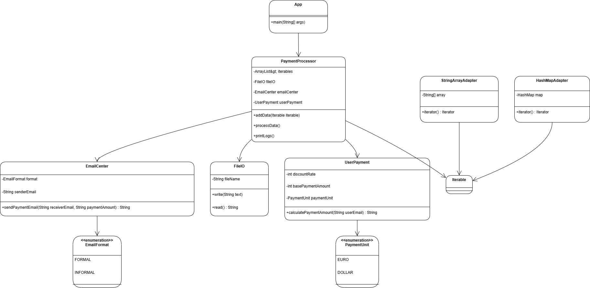

# Assignment 4

In this assignment, we explored key concepts from the Design Patterns course to implement foundational patterns in software design, focusing on creating flexible, modular, and maintainable code structures.

## Explanation

1. **Facade Pattern**  
The **Facade** pattern simplifies interactions with complex subsystems by providing a unified interface. In this assignment, the `PaymentProcessor` class acts as the facade, orchestrating operations between the `UserPayment`, `EmailCenter`, and `FileIO` classes. This pattern abstracts the complexities of payment calculation, email sending, and logging, ensuring a seamless interface for processing user payments.

2. **Adapter Pattern**  
The **Adapter** pattern enables the system to work with various incompatible data structures by adapting them to a common interface. This assignment demonstrates the use of adapters to make non-iterable data structures compatible with the `Iterable<String>` interface required by `PaymentProcessor`.

## Class Diagram

