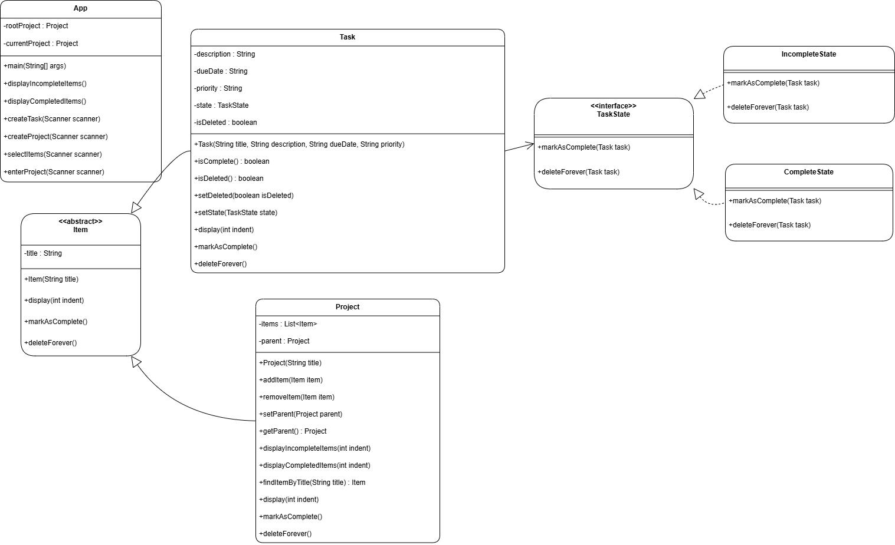
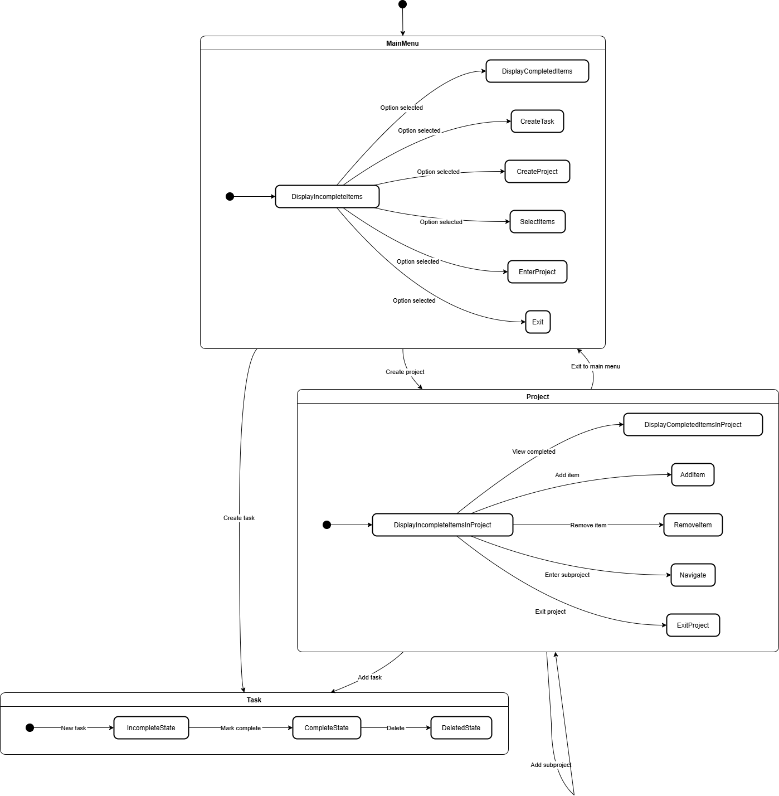

# Assignment 5

In this assignment, we explored key concepts from the Design Patterns course to implement foundational patterns in software design, focusing on creating flexible, modular, and maintainable code structures.

## Explanation

1. **State Pattern**  
The **State** pattern allows an object to alter its behavior when its internal state changes. In this project, the `Task` class uses the State pattern to manage its lifecycle. The states `IncompleteState`, `CompleteState`, and `DeletedState` encapsulate the behavior of a task at different stages. By delegating state-specific behavior to state objects, the Task class remains clean and flexible, making it easier to extend or modify task behavior in the future. For example, transitioning a task from `IncompleteState` to `CompleteState` is managed seamlessly by invoking the appropriate state transitions, adhering to the Open/Closed principle.

2. **Composite Pattern**  
The **Composite** pattern is used to treat individual objects and compositions of objects uniformly. In this project, the `Project` class implements the Composite pattern to manage tasks and subprojects. The `Project` class acts as a composite, containing both `Task` objects (leaf nodes) and other `Project` objects (composite nodes). This allows the user to perform operations like viewing incomplete items, marking items as complete, or navigating subprojects without differentiating between individual tasks and nested projects. The Composite pattern simplifies the hierarchy management and enables recursive operations, such as processing all items within a project or its subprojects.

## Class Diagram

## State Diagram

